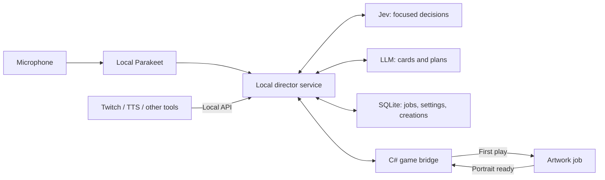

# The Spire Is Listening

**A Slay the Spire 2 run that turns things you say into cards, remembers the jokes, and lets your audience leave fingerprints on the climb.**

Working title and first pitch, 22 September 2026. This describes the experience to build. The research supports the technical direction; there is no playable prototype yet.

## The moment we are trying to create

You're barely surviving a fight. You mutter, “We need a shell. Become crab.” The game gives a small acknowledgement and lets you keep playing.

At the next opportunity, the Spire offers two interpretations: **Emergency Carapace**, a strong one-use defense, or **Sideways Solution**, a smaller defense that also attacks. You choose the one your deck needs—or decline. The card appears with a simple shell illustration and readable rules.

The first time you play it, the effect resolves immediately and an artwork job starts. Later, the portrait fills in: your character sheltering awkwardly beneath an enormous crab. On another floor, chat asks for a laser crab. The director remembers the theme; a later reward might continue it.

The satisfying part is recognizing your own idea, choosing what it becomes, and discovering how to win with it. The image adds a second payoff. The [gameplay research](docs/gameplay-research.md) develops this into a three-minute example; timings and card values there are illustrative.

## Why this could be fun

The Spire already asks the player to build a strategy from unexpected offers. We add a new source of surprises: the player's speech and the audience's imagination.

- **Personal meaning:** “this came from something I said” gives the card a story.
- **A real decision:** different interpretations, a clear cost, and free decline preserve the player's role.
- **A recurring theme:** a few remembered ideas develop across the run instead of every card introducing an unrelated joke.
- **Anticipation:** limited opportunities make the next response interesting. Chat cannot flood the deck by repeating itself.
- **A shared reveal:** first-play artwork gives a good moment a second beat without delaying combat.

The inspected Chimera gameplay shows a useful pattern: discovery of an unusual modifier leads into comparing alternatives. Packmaster shows how bounded themes can create variety; Downfall shows how a recognizable fantasy becomes mechanics. Mega Crit's design material emphasizes useful card niches and preserving deckbuilding, while Valve's director research emphasizes alternating intensity with quiet. These inform the proposal; they do not establish that our version will be fun. [Evidence and inspected video timestamps](docs/gameplay-research.md).

Ambient listening is the main design risk. A player may become self-conscious about thinking aloud if every sentence can change the run. Provide **ambient inspiration** and **hold-to-inspire** modes. In ambient mode, the Spire offers interpretations and the player can ignore them. Sarcasm or frustration should not secretly cause punishment. Narration is optional and quiet during tactical decisions.

## One director, two different kinds of intelligence

**Jev handles focused judgments:** whether a phrase is relevant, whether chat is excited or worried, whether an idea continues the run's theme, and which currently available response fits. Code supplies the legal choices and enforces cooldowns, exact numbers, and budgets.

**The LLM creates and plans:** card names and effects, multiple interpretations, callbacks, and later supported events. It can work on the next idea while the current turn continues. An art provider handles a separate queue.

The game always keeps playing while generation is pending. A fast acknowledgement means the idea was heard; it does not promise that new content is ready. Jev's purpose is inexpensive selection among known options. It cannot create an arbitrary card or replace the game's rule checks. [Provider and decision research](docs/ai-director-research.md).

## The player experience

Start with a restrained default: one unresolved offer, limited inspiration opportunities earned through progress, and a small number of supported effects. A player can ask for something absurd; the director translates the fantasy into a card with an intelligible tradeoff. Exact damage and resource costs come from the selected power rules.

Also provide an explicit **Forge** mode for “make this card now.” It starts generation on demand and can offer the result during the current combat at a safe point. A sandbox preset can remove gameplay scarcity. These modes let us explore the original spontaneous-card fantasy alongside a more paced director experience; generation availability and in-game power are separate controls.

A good generated card can become a persistent part of the deck. Temporary combat cards offer another mode, especially for Twitch interventions. Once a card is accepted, its mechanics stay stable; artwork may arrive later. A run's theme can influence later offers without silently rewriting cards the player already knows.

The dashboard needs a handful of player-facing controls:

| Control | Meaning |
| --- | --- |
| Listening | Off, hold-to-inspire, ambient; input device and transcription language handling |
| Director style | Helpful, mischievous, or deliberately chaotic, with visible intervention rules |
| Frequency and strength | Separate controls for how often content appears and how extreme it can be |
| Card lifetime | Temporary combat gifts or opportunities to earn lasting deck cards |
| Artwork | Generate on first play by default; show pending/ready state |
| Sources | Microphone, audience integrations, and which source may trigger which actions |

Provider/account selection, usage budgets and integration tokens belong in setup. A live activity view shows what was heard, what the director interpreted, what is queued, and why an offer happened. The card library remembers accepted creations and their source moments.

## A mod with an open local API

The mod starts a local companion. The C# bridge observes the game and applies supported actions; a Bun service runs the dashboard, SQLite, speech worker and AI jobs. Existing Twitch/TTS tools can submit text, an event, a mood summary, or a supported action through the API. They do not need to route synthesized speech back through the microphone.

The running game owns live game state. SQLite stores settings, accepted definitions, jobs and art metadata; required card definitions also survive in the modded game save. The director receives state snapshots and the actions currently allowed. Every action is rechecked on the game thread before application. Generated responses tied to an old battle must not leak into the next one. [Proposed API and ownership](docs/ai-director-research.md).

Use **Parakeet TDT v3** locally for German and English. A completed-utterance flow fits the native runtime; streaming microphone capture and incremental transcription are separate questions. Selected text then goes to the configured classifier or LLM. **OpenCode v2's in-process SDK is the main agent runtime**, embedded in the Bun companion with persistent sessions and configurable providers. Its documented account options include ChatGPT subscription authentication. Image generation is a separate capability, with **Codex CLI subprocess jobs** as an optional backend. Packaging OpenCode's native dependencies inside our Bun build still needs verification; plan platform-specific bundles and a separate speech-model download. [Voice/runtime research](docs/voice-and-opencode.md).

## The two crucial technical answers

| Question | Current answer |
| --- | --- |
| Can we introduce new cards while a run is running? | The installed game exposes runtime model injection. Truly new types/IDs also need pool, numeric-ID and save reconstruction handling. It is feasible from the inspected interfaces, but more work than calling a normal card-registration helper. |
| Can artwork arrive after the card exists? | Yes, the source exposes runtime textures and a card UI reload path. First play can queue generation without awaiting it; the result can update existing views or appear on the next draw. |

The proposed true-registration design is a shared data-driven card interpreter plus a thin runtime type for each generated definition. It needs stable identities and reconstruction before save loading. A single pre-registered type with instance data is a distinct option, but it does not prove new type/ID registration. The first experiment must test the actual distinction. [Installed-game source investigation](docs/runtime-cards-and-art.md).

## First playable slice

1. **Resolve the engine behavior.** Create a genuinely new type/ID after initialization, place its card in play, save/reload it, and replace its art after first play. Check copies and simultaneous views. Use fixed local data and a local image so model latency cannot hide engine problems.
2. **Make one spoken idea playable.** Local Parakeet → OpenCode-hosted LLM generates a card specification → validated card offer → accepted card. Persist it in SQLite and the run save. Start the selected artwork backend on first play and update the portrait when it completes.
3. **Make the director worth leaving on.** Add Jev routing, quiet periods, callbacks, and a small set of intervention rules. Compare ambient offers with deliberate inspiration. Watch whether players enjoy the result and continue making meaningful deck choices.
4. **Open it to the audience.** Connect an existing Twitch tool through the same API. Aggregate suggestions, deduplicate TTS/chat events, and give the streamer a clear override. Expand the action catalog to additional game systems only after each action has a reliable engine implementation.

The first success is one short run segment someone wants to show a friend: “I said that, it became this card, and then it saved me.” Record time to acknowledgement, time to playable card, first-play art completion, declined offers, interruptions and whether accepted cards are actually useful. Source research is complete for this first pitch; those gameplay and latency outcomes still need a playable build.
