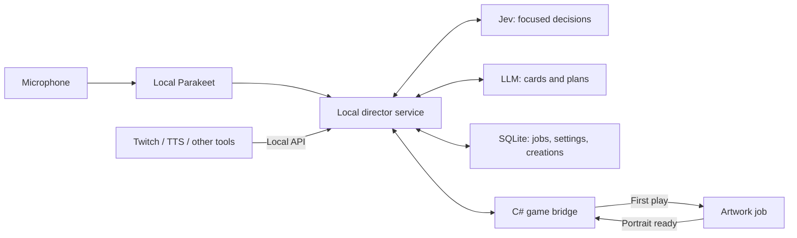

# The Spire Is Listening

**A Slay the Spire 2 run that turns things you say into cards, remembers the jokes, and lets your audience leave fingerprints on the climb.**

Working title and first pitch, 22 September 2026. This describes the experience to build. The research supports the technical direction; there is no playable prototype yet.

## The moment we are trying to create

You're barely surviving a fight. You mutter, “We need a shell. Become crab.” The game gives a small acknowledgement and lets you keep playing.

In **Wildcard**, the next card reward has one familiar option replaced by **Emergency Carapace**, a generated card with the same rarity as the option it replaced. The other choices remain. You choose whether the crab card belongs in your deck, or skip normally. It appears with a simple shell illustration and readable rules.

In **Living Deck**, the director can instead turn an eligible card already in your deck into Carapace when the context and tuning rules permit it. You see what changed and why; the transformation happens automatically. The aim is a surprising sidegrade with a tactical tradeoff.

The first time you play it, the effect resolves immediately and an artwork job starts. Later, the portrait fills in: your character sheltering awkwardly beneath an enormous crab. On another floor, chat asks for a laser crab. The director remembers the theme; a later reward might continue it.

The satisfying part is recognizing your own idea, choosing what it becomes, and discovering how to win with it. The image adds a second payoff. The [gameplay research](docs/gameplay-research.md) develops this into a three-minute example; timings and card values there are illustrative.

## Why this could be fun

The Spire already asks the player to build a strategy from unexpected offers. We add a new source of surprises: the player's speech and the audience's imagination.

- **Personal meaning:** “this came from something I said” gives the card a story.
- **A real decision:** Wildcard puts an unfamiliar option beside ordinary rewards. Living Deck asks the player to adapt to a changed tool.
- **A recurring theme:** a few remembered ideas develop across the run instead of every card introducing an unrelated joke.
- **Anticipation:** every reward brings one wildcard, while Living Deck has its own cadence. Repeated chat does not multiply replacements.
- **A shared reveal:** first-play artwork gives a good moment a second beat without delaying combat.

The inspected Chimera gameplay shows a useful pattern: discovery of an unusual modifier leads into comparing alternatives. Packmaster shows how bounded themes can create variety; Downfall shows how a recognizable fantasy becomes mechanics. Mega Crit's design material emphasizes useful card niches and preserving deckbuilding, while Valve's director research emphasizes alternating intensity with quiet. These inform the proposal; they do not establish that our version will be fun. [Evidence and inspected video timestamps](docs/gameplay-research.md).

Ambient listening is a design risk: a player may become self-conscious about thinking aloud if every sentence can change the run. Provide ambient listening and hold-to-inspire as input settings for either gameplay mode. Wildcard preserves the normal reward choice; Living Deck explicitly opts into autonomous changes with tuning and optional protected cards. Sarcasm or frustration should not secretly change the power budget. Narration is optional and quiet during tactical decisions.

## One director, two different kinds of intelligence

**Jev handles focused judgments:** whether a phrase is relevant, whether chat is excited or worried, whether an idea continues the run's theme, and which currently available response fits. Code supplies the legal choices and enforces cooldowns, exact numbers, and budgets.

**The LLM creates and plans:** card names and effects, multiple interpretations, callbacks, and later supported events. It can work on the next idea while the current turn continues. An art provider handles a separate queue.

The game always keeps playing while generation is pending. A fast acknowledgement means the idea was heard; it does not promise that new content is ready. Jev's purpose is inexpensive selection among known options. It cannot create an arbitrary card or replace the game's rule checks. [Provider and decision research](docs/ai-director-research.md).

## Two gameplay modes

**Wildcard:** replace exactly one option in every card reward. Preserve that option's rarity, keep the other choices, and let the player select or skip normally. Speech/chat shapes the concept; the wildcard still appears when there is no fresh input. Reward frequency follows the game, so this mode does not have an intervention cooldown.

**Living Deck** (working name): the director automatically replaces a card already in the persistent deck one-for-one when it finds an appropriate moment. Separate tunables control frequency, strength, synergy and eligibility. A change should create a new situation to play around. Automatically improving the weakest card every time would steadily trivialize the run even if rarity stayed constant.

For the first Living Deck playtest, propose a conservative cadence, sidegrade-oriented power, protected favorites and a cooldown on repeatedly replacing the same card. Those are initial tuning hypotheses. Same rarity alone does not guarantee fair strength: account for draw/energy combinations, removed drawbacks, deck synergy and cumulative changes. Both modes keep placeholder art until the first play triggers generation. [Mode rules and proposed tuning](docs/game-modes.md).

The dashboard needs a handful of player-facing controls:

| Control | Meaning |
| --- | --- |
| Listening | Off, hold-to-inspire, ambient; input device and transcription language handling |
| Gameplay mode | Wildcard rewards or autonomous Living Deck replacements |
| Replacement frequency | Living Deck cooldown and ceiling; Wildcard always changes one option per reward |
| Strength and synergy | Separate limits on individual power and how aggressively changes optimize the deck |
| Eligible/protected cards | Living Deck target rules, favorite-card pins and repeat-change protection |
| Artwork | Generate on first play by default; show pending/ready state |
| Sources | Microphone, audience integrations, and which source may trigger which actions |

Provider/account selection, usage budgets and integration tokens belong in setup. A live activity view shows what was heard, what the director interpreted, what is queued, and why an offer happened. The card library remembers accepted creations and their source moments.

## A mod with an open local API

The mod starts a local companion. The C# bridge observes the game and applies supported actions; a Bun service runs the dashboard, SQLite, speech worker and AI jobs. Existing Twitch/TTS tools can submit text, an event, a mood summary, or a supported action through the API. They do not need to route synthesized speech back through the microphone.

The running game owns live game state. SQLite stores settings, accepted definitions, jobs and art metadata; required card definitions also survive in the modded game save. The director receives state snapshots and the actions currently allowed. Every action is rechecked on the game thread before application. Generated responses tied to an old battle must not leak into the next one. [Proposed API and ownership](docs/ai-director-research.md).

Use **Parakeet TDT v3** locally for German and English. A completed-utterance flow fits the native runtime; streaming microphone capture and incremental transcription are separate questions. Selected text then goes to the configured classifier or LLM. **OpenCode v2's in-process SDK is the main agent runtime**, embedded in the Bun companion with persistent sessions and configurable providers. Its documented account options include ChatGPT subscription authentication. Image generation is a separate capability, with **Codex CLI subprocess jobs** as an optional backend. Packaging OpenCode's native dependencies inside our Bun build still needs verification; plan platform-specific bundles and a separate speech-model download. [Voice/runtime research](docs/voice-and-opencode.md).

## The two crucial technical answers

| Question | Current answer |
| --- | --- |
| Can we introduce new cards while a run is running? | The installed game exposes runtime model injection. Truly new types/IDs also need pool, numeric-ID and save reconstruction handling. It is feasible from the inspected interfaces, but more work than calling a normal card-registration helper. |
| Can artwork arrive after the card exists? | Yes, the source exposes runtime textures and a card UI reload path. First play can queue generation without awaiting it; the result can update existing views or appear on the next draw. |

The proposed true-registration design is a shared data-driven card interpreter plus a thin runtime type for each generated definition. It needs stable identities and reconstruction before save loading. A single pre-registered type with instance data is a distinct option, but it does not prove new type/ID registration. The first experiment must test the actual distinction. [Installed-game source investigation](docs/runtime-cards-and-art.md).

## First playable slice

1. **Resolve the engine behavior.** Create a genuinely new type/ID after initialization, place its card in play, save/reload it, and replace its art after first play. Check copies and simultaneous views. Use fixed local data and a local image so model latency cannot hide engine problems.
2. **Make Wildcard playable.** Local Parakeet → OpenCode-hosted LLM generates a card specification → exactly one same-rarity replacement in every card reward. Persist the reward assignment and accepted cards. Start the artwork backend on first play.
3. **Make Living Deck playable.** Add autonomous one-for-one replacements, Jev routing, independent frequency/power/synergy controls, callbacks and visible change history. Check cumulative deck strength and how players adapt. Define and verify safe replacement of live combat copies before allowing in-combat changes.
4. **Open it to the audience.** Connect an existing Twitch tool through the same API. Aggregate suggestions, deduplicate TTS/chat events, and give the streamer a clear override. Expand the action catalog to additional game systems only after each action has a reliable engine implementation.

The first success is one short run segment someone wants to show a friend: “I said that, it became this card, and then it saved me.” Record time to acknowledgement, time to playable card, first-play art completion, declined offers, interruptions and whether accepted cards are actually useful. Source research is complete for this first pitch; those gameplay and latency outcomes still need a playable build.
