# AI providers, decisions, and the local service

Researched 2026-09-22. This note distinguishes documented interfaces, local capability checks, and the architecture proposed for our mod. No LLM request, image-generation job, or paid classification request was submitted.

## Selected runtime: embedded OpenCode v2

Use **OpenCode v2's in-process SDK** in the Bun companion. The user has tried Codex app-server over stdio and prefers the OpenCode SDK; that is the architectural decision for this project. The current embedded entrypoint is `OpenCode.create()` from `@opencode/sdk`, with a persistent database path. OpenCode's account documentation includes ChatGPT subscription authentication alongside other provider methods. [SDK](https://opencode.ai/v2/docs/build/sdk/), [provider accounts](https://opencode.ai/v2/docs/cli/providers), [packaging and exact contracts](voice-and-opencode.md).

Each task gets bounded game context and a narrow output contract; conversation history should not grow with every chat message. Expose supported game actions and artwork generation as explicit tools. Keep the director's provider and the artwork backend independently configurable.

## Optional Codex CLI artwork jobs

`codex exec` supports non-interactive jobs, JSONL events, and a final JSON Schema. It can be invoked as a subprocess by an artwork worker. Spawn it with an argument array, pass prompt text as data, and give each job a dedicated output directory. The companion owns timeout, cancellation and artifact ingestion. [CLI commands](https://learn.chatgpt.com/docs/developer-commands#codex-exec).

Local checks on **Codex CLI 0.155.1**:

- Its generated app-server protocol contains `modelProvider/capabilities/read`.
- A short-lived local app-server returned `imageGeneration: true`, `namespaceTools: true`, and `webSearch: true` from that read-only method.
- The generated schema includes `imageGeneration` events with `result`, `status`, and optional `savedPath`.
- `codex exec --help` confirms `--json`, `--output-schema`, `--ephemeral`, and `--ignore-user-config` (the latter still uses the normal auth location).

The app-server was used only for that capability probe and is not part of the selected architecture. This establishes that the local provider advertises images; it does not establish the complete `codex exec` image/artifact path, generation latency, remaining account quota, or identical access for every user's plan. The generated protocol is reproducible with `codex app-server generate-json-schema --out <directory>`; diagnostic files remain in ignored `.research/codex-schema/`.

The first artwork integration check is a bounded CLI job that produces a file and returns enough metadata for the companion to associate it with the requested card. Do this independently of game code before relying on it for first-play generation.

Keep image generation as its own job/capability even when Codex supplies both writing and art. A separate API-backed image provider is also possible through the Images or Responses APIs; that is a distinct integration and billing path, not something to infer from a player's ChatGPT login. [Image generation API](https://developers.openai.com/api/docs/guides/image-generation).

OpenCode's embedded packages, authentication and packaging limits are evaluated in [voice-and-opencode.md](voice-and-opencode.md). Support each selected provider's actual capabilities instead of assuming every text model also creates images.

## Jev: the fast decision loop

The project is **Jev by TypeSafe AI**. Its documented current model is `jev-1.13.0`. It accepts text/structured text, charges $0.042 per million input tokens, and does not charge for output tokens. German is not its strongest documented language; the vendor says English performs best. These are published terms, not a benchmark on our game inputs. [Models](https://docs.typesafe.ai/models).

It offers three useful primitives: `choice` selects a supplied option, `score` judges a defined scale, and `noul` estimates the probability of a yes/no proposition. Multiple questions can share a state input, but each is evaluated independently. [Primitives](https://docs.typesafe.ai/primitives).

For this mod, ask focused questions:

| Question | Input selected by code | Output used by code |
| --- | --- | --- |
| Does this utterance express a usable card idea? | Completed transcript, explicit examples, current listening mode | Candidate or ignore |
| What is chat's current tone? | A bounded window of text with duplicate counts already computed | Supportive, tense, playful, hostile, unclear |
| Which offered intervention best matches that tone? | A short list of actions already legal in this game phase | One action ID or no action |
| Is this a callback to the current run's theme? | Candidate plus a small relevant memory | Probability used to prioritize a candidate |

The state machine and exact rules remain ordinary code: health thresholds, cooldowns, action legality, vote counts, budgets and card arithmetic. Jev's own limitations page calls out numeric reasoning, irrelevant context, adversarial text, and generation as weak areas. It cannot invent the next card's name, rules, artwork or an unconstrained action. [Known limitations](https://docs.typesafe.ai/model-jaggedness/jev-1.13).

**Recommendation:** run Jev after completed utterances and on aggregated chat windows, not once per frame or once per token. Include a no-action outcome, and calibrate action-specific thresholds on German/English speech, game jargon, jokes and real chat. Confidence does not establish an action's correctness; the documented Choice confidence measures how strongly its distribution favors a choice. [Confidence](https://docs.typesafe.ai/confidence).

As an illustrative cost calculation, 1,800 requests of 1,000 billed input tokens over an hour would cost about **$0.076** at the published rate. That excludes LLMs, artwork and all other services; neither those token sizes nor throughput have been measured for this project. Vendor speed comparisons are not a latency promise on this Mac. Measure classification and generation separately.

## The slower creative loop

The LLM designs a card or another supported intervention using the selected signal, run theme, current deck and the game's available actions. It may also plan a callback for a later room. Code validates the result and decides when it can be applied. Generation runs in the background; existing play continues.

The fast loop can choose an already prepared response while the LLM prepares something more specific. Those are two explicit product capabilities: quick selection from available options, and slower creation of new content. Their queues, deadlines and dashboard statuses should be separate. The player should see “idea heard” quickly without being promised that a newly generated card already exists.

## Game phase and director state are separate

The following is a proposed normalized state machine, not a claim about existing game enum names. The bridge derives phase from game events and exposes only actions allowed by the selected [gameplay mode](game-modes.md):

| Observed game phase | Examples of allowed director actions |
| --- | --- |
| No active run | Configure, inspect the library; no gameplay changes |
| Combat action resolving | Remember a theme or prepare content; hold deck mutations |
| Player can act | Prepare content; Living Deck may commit at a verified safe boundary if its targeting/eligibility rules permit |
| Card reward being prepared | Wildcard replaces exactly one option, preserving that option's rarity |
| Card reward open | Normal selection/skip; no transformation of unchosen options |
| Wildcard taken, reward interaction active | Keep, transform once, or use Lucky on the acquired card; both transformation routes consume the same allowance |
| Next player turn starts | Fulfill draw obligations from committed deck transformations exactly once |
| Room transition | Living Deck may commit an eligible replacement; reconcile jobs and update its progress-based budget |

The companion separates the two modes' lifecycles:

```mermaid
stateDiagram-v2
    [*] --> Watching
    Watching --> Preparing: Wildcard reward or eligible Living Deck decision
    Preparing --> Ready: Validated definition
    Preparing --> Watching: Failed or obsolete
    Ready --> RewardOpen: Wildcard slot assigned before selection
    RewardOpen --> Watching: Pick another card or skip
    RewardOpen --> Acquired: Commit to taking wildcard
    Acquired --> Watching: Keep or finish reward interaction
    Acquired --> Transforming: Transform or Lucky; reserve one allowance
    Transforming --> Acquired: Failed request; release reservation
    Transforming --> Watching: Commit replacement; consume allowance; schedule next draw
    Ready --> Replacing: Living Deck target valid at safe boundary
    Replacing --> CoolingDown: Commit replacement and schedule next draw
    CoolingDown --> Watching: Living Deck progress budget allows another change
```

Jev receives a small context and the currently admissible choices. While `Preparing`, another crab message may permit `reinforce_theme` or `ignore`. In Wildcard, ignoring a signal never omits the required reward replacement; absent new input, generation uses the run theme/context. Its optional transformation becomes legal only after acquisition. In Living Deck, `do_nothing` is valid even when the cooldown has expired. The LLM receives the selected request; it does not own the transition table. Code rechecks the target, acquisition allowance and last transformed turn immediately before application. Living Deck changes happen automatically, without per-replacement confirmation.

Transformation identity follows the persistent card instance across replacement types. Keep next-turn draw obligations separately from the director lifecycle so pending draws do not stop other AI work. Turn-start delivery must survive pile changes/reconnection and must not clone the card or deliver it twice. Outside combat, the obligation targets the next combat's first turn. Exact draw-capacity and draw-prevention interactions remain an engine implementation check.

Lucky is a generation intent within an existing transformation, using a fresh deck snapshot and a target of 6–12/10 quality with a directional twist. A strong card may dismantle the current strategy or wreck the run. Evaluate its complete payoff, cost and risk; do not impose a blanket exclusion of dangerous or destructive effects. Pure punishment without a worthwhile upside fails the quality target. Mechanical validity and subjective card quality are separate checks, and a model's numerical self-rating establishes neither. See [the mode rules](game-modes.md) for the rubric.

Artwork has its own lifecycle: `unrequested → queued on first successful play → generating → ready`, with an explicit failed state. The accepted card remains playable in all of these states. Use one job per immutable definition/art revision so multiple copies and replays do not repeatedly spend generation quota. A transformed definition gets its own art revision; completion of an older image job cannot overwrite its portrait.

## Local server and SQLite

**Proposed ownership:** the mod starts a local companion as part of enabling the feature. The C# bridge owns game observation and applies commands on the game thread. A Bun companion hosts the integration API/dashboard, owns SQLite, and runs transcription, classification and generation jobs. This preserves a mod-driven startup experience while keeping model work and database operations outside the game's frame loop. Process startup/packaging is still to be implemented.

Bun includes `bun:sqlite` with file-backed/in-memory databases and transactions. Its API is synchronous; keep this work in the companion and use short transactions. WAL supports concurrent readers with one writer, which fits a single companion owning persistence. [Bun SQLite](https://bun.com/docs/runtime/sqlite), [SQLite WAL](https://sqlite.org/wal.html).

| State | Owner |
| --- | --- |
| Live HP, hand, enemies, turn, legal actions | The running game; companion snapshots are observations |
| Active queues, partial transcripts, short chat windows | Companion memory |
| Settings, mode rules, integrations, definitions, reward assignments, acquisition/transform allowance, replacement lineage/budgets, Lucky intent, jobs, provenance, art index | Companion SQLite |
| Generated card data, last transformed turn and unfulfilled next-turn draw obligations needed to resume a run | The game's modded save, containing required immutable definitions and instance state |
| Generated image files | Local asset cache, referenced by definition/art revision |

SQLite gives us a card library, restart recovery, visible generation history, and deduplication. It should not become a second simulator that writes its own notion of game state. Pending jobs must be reconciled with the actual run when reconnecting.

## A public integration contract worth building

Proposed routes, not implemented APIs:

| Interface | Purpose |
| --- | --- |
| `GET /v1/state` | Game snapshot, current phase, state revision, available capabilities |
| `GET /v1/actions` | Actions permitted by the current phase and selected director mode |
| `POST /v1/signals` | Speech text, Twitch events, TTS source text, or an external mood summary |
| `POST /v1/actions` | Submit a supported action with an idempotency key and expected run/state |
| `GET /v1/jobs/:id` | Card or art generation progress and result |
| `GET /v1/events` | A streamed feed for the dashboard and existing integrations |

An integration can submit the original TTS text; it does not need to play audio into the microphone. Tag the origin so generated TTS does not loop back into new card requests. Twitch tools can submit signals or prebuilt card specifications through the same contract. Action execution remains subject to game legality and the player's selected intervention rules.

The bridge rechecks the current run, phase and target immediately before applying an action. A response produced for a previous combat may be postponed to an explicitly chosen later opportunity or discarded; it must never silently target the new combat. Record applied action IDs so reconnects cannot grant the same card twice. Local integration tokens, loopback binding, and no raw shell/eval endpoint make the intended external integration surface concrete.
